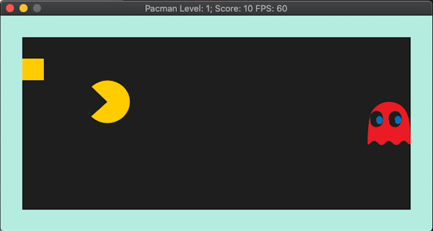
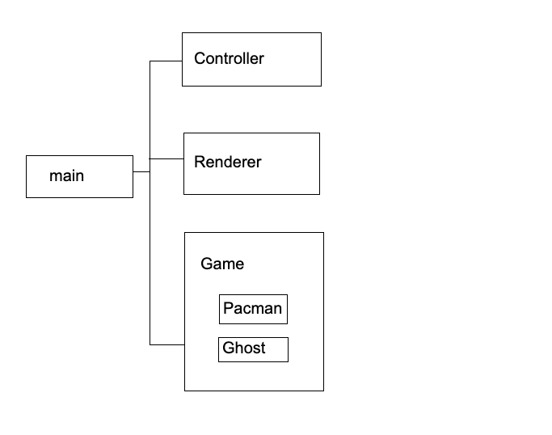

# CPPND: Capstone Modified Pacman Game 

This is the repo for the Capstone project in the [Udacity C++ Nanodegree Program](https://www.udacity.com/course/c-plus-plus-nanodegree--nd213). This uses the [Snake game](https://github.com/udacity/CppND-Capstone-Snake-Game) codes provided in the Nanodegree course. 

## How To Play The Game
This is a watered-down version of the Pacman game, where your goal is to get the coin without getting caught by the ghost.

* Controls: 
  * You can move the Pacman using the arrow keys on the keyboard.
* Scoring:
  * In the first level (level 0) you get 10 points if you get the coin. For each level after that the points you get for getting a coin increases by 10. The score is displayed in the window title along with the level and the frame per second rate.
* Ghost
  * The ghost starts appearing after the first level, and you will have to try avoiding it.
* Leveling
  * With each level the speed of both the Pacman and the ghost increases. Level is displayed in the window title. 
* Game Over
  * The game terminates if you get caught by the ghost. There is no limit on how many levels you can reach. 

## Dependencies for Running Locally
* cmake >= 3.7
  * All OSes: [click here for installation instructions](https://cmake.org/install/)
* make >= 4.1 (Linux, Mac), 3.81 (Windows)
  * Linux: make is installed by default on most Linux distros
  * Mac: [install Xcode command line tools to get make](https://developer.apple.com/xcode/features/)
  * Windows: [Click here for installation instructions](http://gnuwin32.sourceforge.net/packages/make.htm)
* SDL2 >= 2.0
  * All installation instructions can be found [here](https://wiki.libsdl.org/Installation)
  * Note that for Linux, an `apt` or `apt-get` installation is preferred to building from source.
* SDL2_Image
  * For image binaries go to [this page](https://www.libsdl.org/projects/SDL_image/)
  * For instructions refer to [this page](https://lazyfoo.net/tutorials/SDL/06_extension_libraries_and_loading_other_image_formats/index.php)
  * On Max OS X, Homebrew can be used to install sdl2_image 
* gcc/g++ >= 5.4
  * Linux: gcc / g++ is installed by default on most Linux distros
  * Mac: same deal as make - [install Xcode command line tools](https://developer.apple.com/xcode/features/)
  * Windows: recommend using [MinGW](http://www.mingw.org/)

## Basic Build Instructions

1. Clone this repo.
2. Make a build directory in the top level directory: `mkdir build && cd build`
3. Compile: `cmake .. && make`
4. Run it: `./Pacman`.

## Concepts from the Program
This project incorporates the concepts learned in the program.
The following are the specifications from the course material that this program touches on (also marked in the codes as comments where applicable):
* C1: The project reads data from a file and process the data: The project reads from an external file (renderer.cpp:192)
* C2: The project accepts user input and processes the input: The project accepts input from a user as part of the necessary operation of the program. (game.cpp:105)
* C3: The project uses Object Oriented Programming techniques: The project code is organized into classes with class attributes to hold the data, and class methods to perform tasks. (pacman.cpp, renderer.cpp, game.cpp)
* C4: Classes use appropriate access specifiers for class members: All class data members are explicitly specified as public, protected, or private. (pacman.cpp, renderer.cpp, game.cpp)
* C5: Classes encapsulate behavior: Appropriate data and functions are grouped into classes. Member data that is subject to an invariant is hidden from the user. State is accessed via member functions. (pacman.cpp, renderer.cpp, game.cpp)
* C6: Overloaded functions allow the same function to operate on different parameters: One function is overloaded with different signatures for the same function name. (renderer.h:16)
* C7: The project uses smart pointers instead of raw pointers: The project uses at least one smart pointer. (renderer.h:49)
* C8: The project makes use of references in function declarations: At least two functions use pass-by-reference in the project code. (game.h:22)

## Code Structure & Overview
* src directory contains all of the header and source files
* images directory contains the images used in the program

Main initializes the Renderer, the Controller and the Game. The Game class is where the main processing for the game happens, with the while loop running until either the game terminates or the user quits (i.e. by clicking on x). The Renderer uses the information that the Game class processes and displays the current view on the screen. 

In the Game class, several checks are being done using the fuctions from the Pacman class:
* If the Pacman will go outside of the game area
* If the Pacman collides with the coin (i.e. the Pacman grabs the coin and scores points)
* If the Pacman collides with the ghost (i.e. the Pacman is caught and the game terminates)

A new level starts when the Pacman gets the coin, at which point the location of both the coin and the ghost is reset to another random point, and the renderer renders the display accordingly. 

When the Pacman collides with the Ghost, the program ends and displays the Game Over screen. The program waits for user input and exits when the user presses 'q'. 